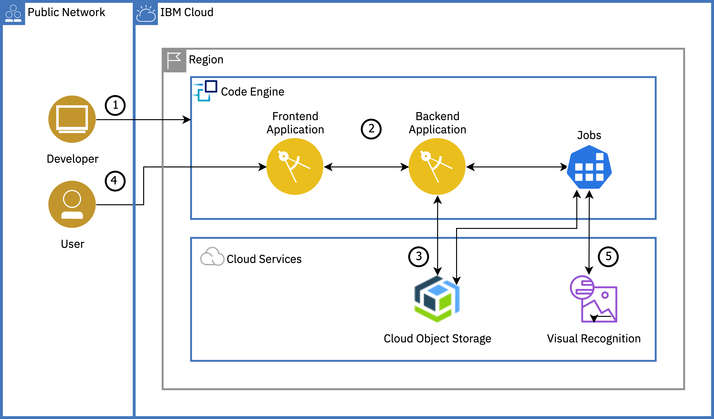

# Text analysis with Code Engine

> Companion code sample to the [Code Engine solution tutorial](https://cloud.ibm.com/docs/solution-tutorials?topic=solution-tutorials-text-analysis-code-engine)

Following the steps in the [solution tutorial](https://cloud.ibm.com/docs/solution-tutorials?topic=solution-tutorials-text-analysis-code-engine) and using this code sample, you will learn about [IBM Cloud™ Code Engine](https://cloud.ibm.com/codeengine/overview) by deploying a text analysis with IBM Watson natural language understanding application.

You will create a Code Engine project, select the project and deploy Code Engine components - applications and jobs to the project. You will learn how to bind IBM Cloud services (Cloud Object Storage and Natural Language Understanding) to your Code Engine components. You will also understand the auto-scaling capability of Code Engine where instances are scaled up or down (to zero) based on incoming workload.

IBM Cloud™ Code Engine is a fully managed, serverless platform that runs your containerized workloads, including web apps, micro-services, event-driven functions, or batch jobs. Code Engine even builds container images for you from your source code. Because these workloads are all hosted within the same Kubernetes infrastructure, all of them can seamlessly work together. The Code Engine experience is designed so that you can focus on writing code and not on the infrastructure that is needed to host it.

## Architecture

## License

Check the [License](License)
